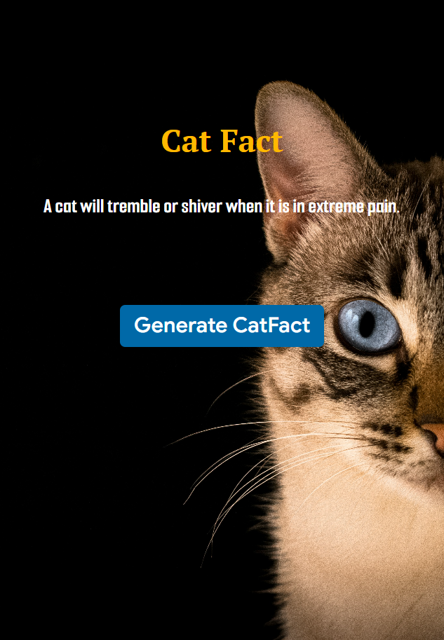
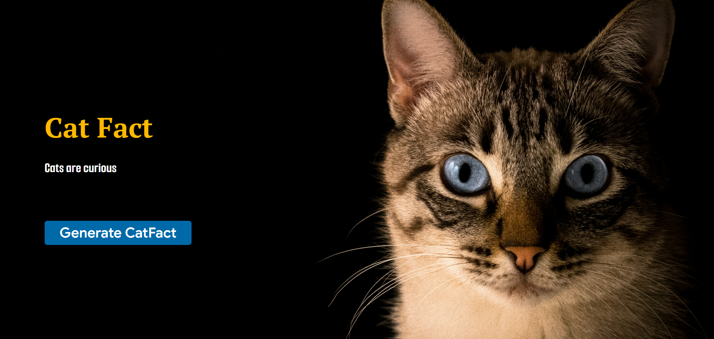

# 🐱 Cat Fact Generator

## [Live @](https://react-catfact-api-proj-05.vercel.app/)

## 📋 Overview

<p>A responsive React application that fetches random cat facts from a public API and displays them on a visually appealing background. Built using React, Axios, and Tailwind CSS.</p>

## 📸 Preview

### Mobile View

### Desktop View


## ✨ Features

<ul>
<li>Fetches random cat facts using a public API
</li>
<li>Fast API calls with Axios</li>
<li>Fully responsive UI (mobile, tablet, desktop)
</li>
<li>Full-screen background image with proper scaling</li>
<li>Clean and beginner-friendly React code</li>
<li>Smooth hover effects and transitions</li>
</ul>

## 🛠️ Tech Stack

<ul>
<li>React (Functional Components & Hooks)</li>
<li>Axios (HTTP requests)</li>
<li>Tailwind CSS (Styling & responsiveness)</li>
<li>Vite / CRA (depending on your setup)</li>
</ul>

## 📂 Project Structure

```
src/
├── assets/
│   └── imgbg04.jpg
├── App.jsx
├── main.jsx
└── index.css
```

## 📦 Installation & Setup

#### 1.Clone the repository
```
git clone https://github.com/Aromalpriyan/React-Catfact-API-Proj-05
```

#### 2.Navigate to the project directory
```
cd cat-fact-generator
```

#### 3.Install dependencies
```
npm install
```

#### 4.Start the development server
```
npm run dev
```

## 🔗 API Used
<ul>
<li>Cat Facts API</li>
</ul>
https://catfact.ninja/fact

## 📄 License

<p>This project is licensed under the MIT License
</p>

## 👨‍💻 Author
#### Aromal Priyan
<ul>
<li>GitHub : https://github.com/Aromalpriyan/React-Catfact-API-Proj-05</li>
</ul>